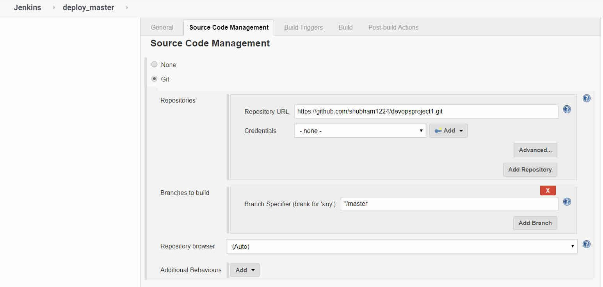
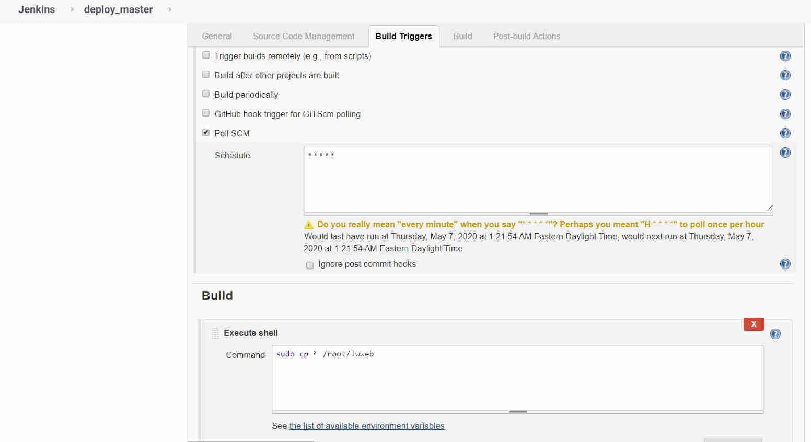
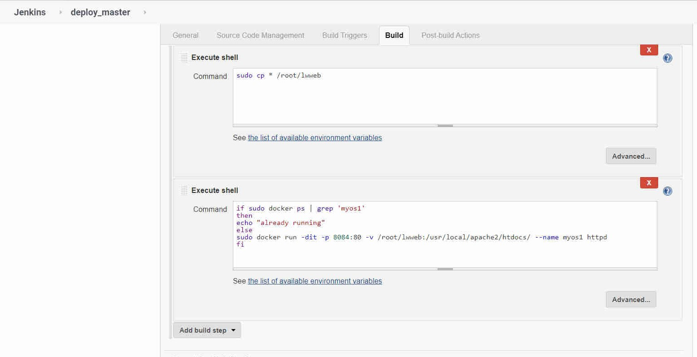
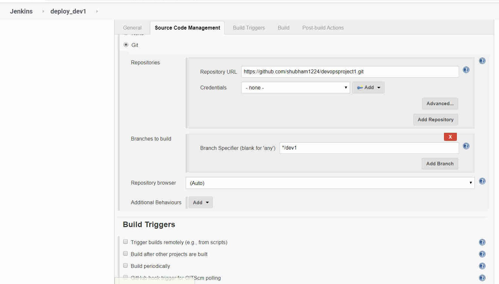
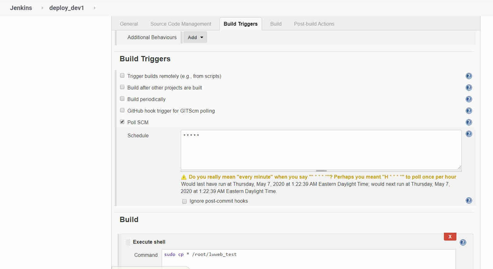
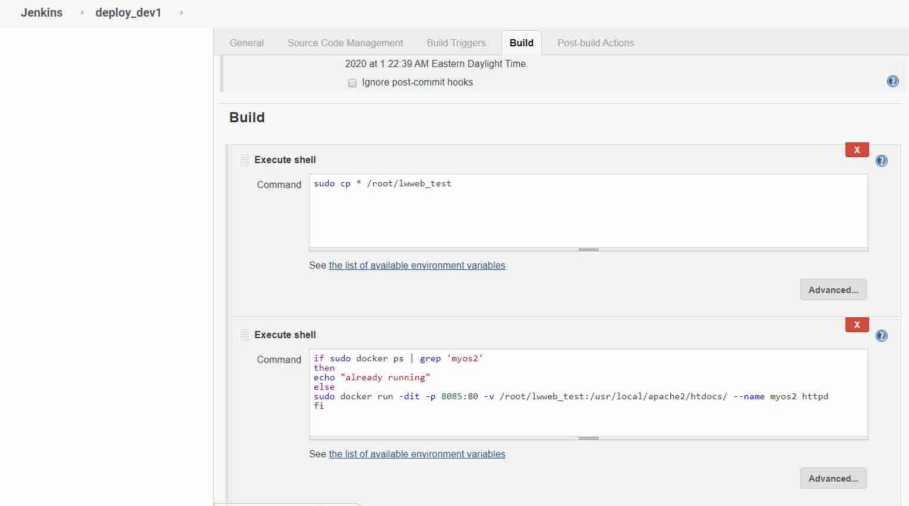
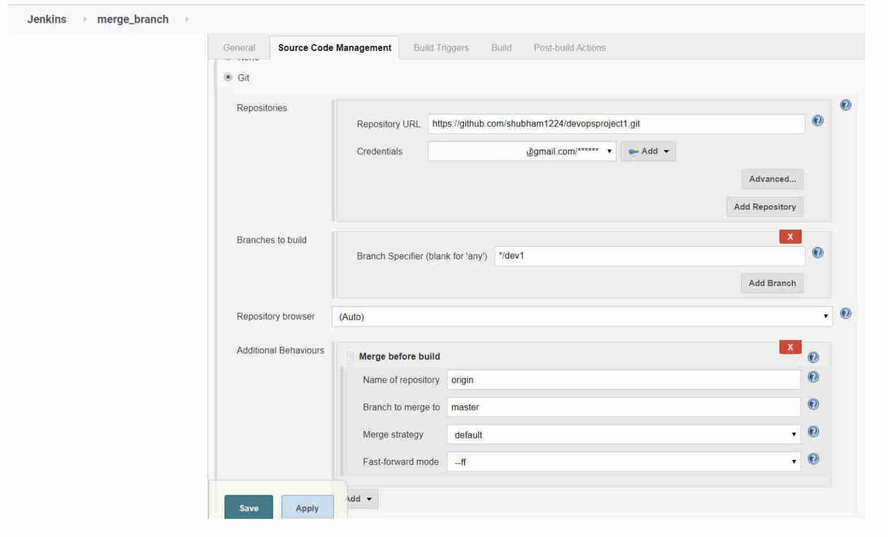
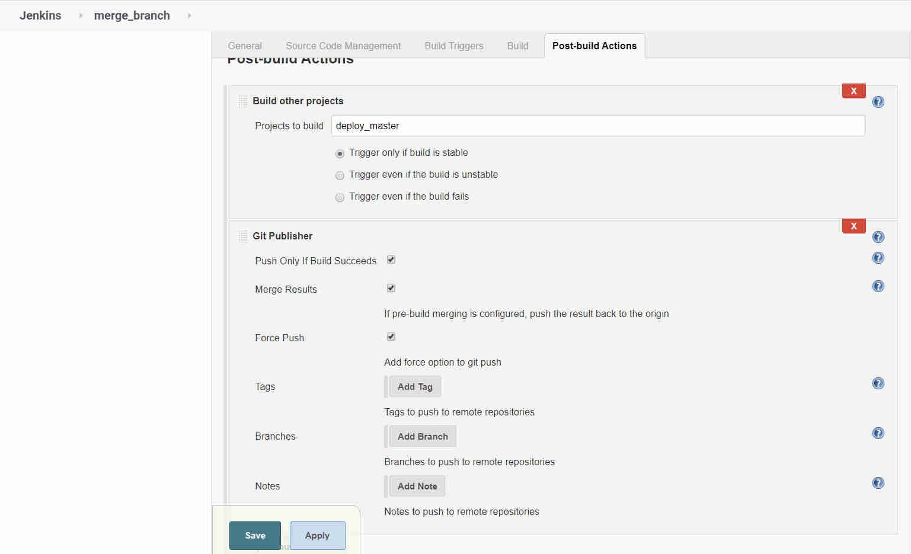

<b>setup to deploy code on webserver in just one click</b>

overview - overview - 
create multiple jobs in jenkins to automate the thing.
integrating github and jenkins to deploy webpages on remote system.

job1 : deploy_master

     

job2 : deploy_dev1 

job3 : merge_branch

 
     
       

 
